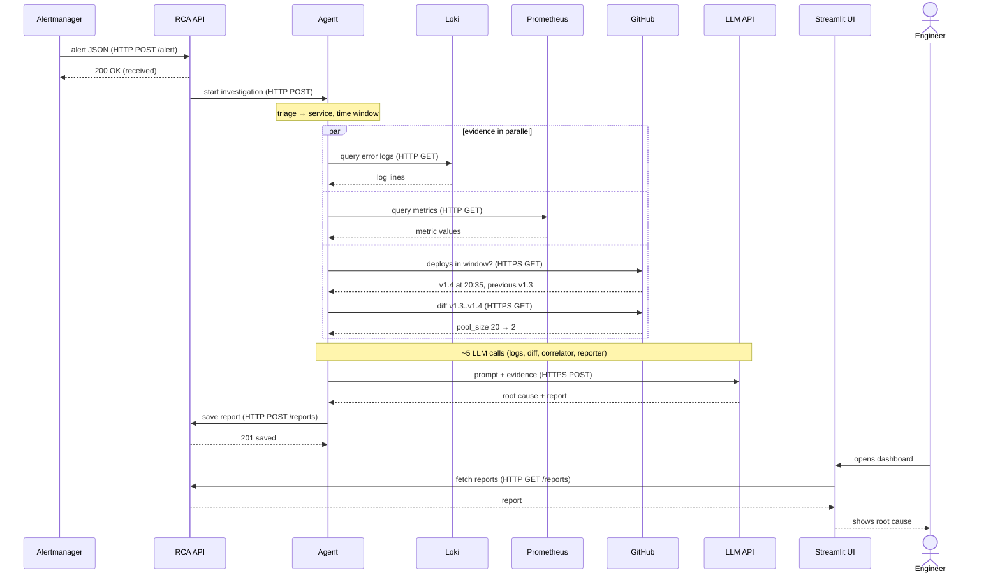

```mermaid
sequenceDiagram
    participant AM as Alertmanager
    participant API as RCA API
    participant AG as Agent
    participant LK as Loki
    participant PR as Prometheus
    participant GH as GitHub
    participant LLM as LLM API
    participant UI as Streamlit UI
    actor ENG as Engineer

    AM->>API: alert JSON (HTTP POST /alert)
    API-->>AM: 200 OK (received)
    API->>AG: start investigation (HTTP POST)
    Note over AG: triage → service, time window

    par evidence in parallel
        AG->>LK: query error logs (HTTP GET)
        LK-->>AG: log lines
    and
        AG->>PR: query metrics (HTTP GET)
        PR-->>AG: metric values
    and
        AG->>GH: deploys in window? (HTTPS GET)
        GH-->>AG: v1.4 at 20:35, previous v1.3
        AG->>GH: diff v1.3..v1.4 (HTTPS GET)
        GH-->>AG: pool_size 20 → 2
    end

    Note over AG,LLM: ~5 LLM calls (logs, diff, correlator, reporter)
    AG->>LLM: prompt + evidence (HTTPS POST)
    LLM-->>AG: root cause + report

    AG->>API: save report (HTTP POST /reports)
    API-->>AG: 201 saved

    ENG->>UI: opens dashboard
    UI->>API: fetch reports (HTTP GET /reports)
    API-->>UI: report
    UI-->>ENG: shows root cause
```